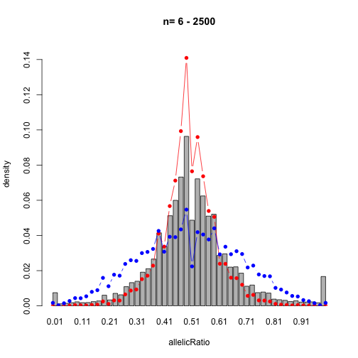

## Prepare the data.


```r
library(chenimbalance)
total_reads <- rowSums(accb[, c("cA", "cC", "cG", "cT")])
data <- data.frame(
  total = total_reads,
  allelicRatio = sapply(
    1:nrow(accb),
    function(i) {
      accb[[paste("c", accb[["ref"]][[i]], sep = "")]][[i]] / total_reads[[i]]
    }
  )
)
head(data)
#>   total allelicRatio
#> 1    45    1.0000000
#> 2    59    0.5423729
#> 3   114    0.4736842
#> 4    53    0.5094340
#> 5   119    0.5042017
#> 6    21    0.0952381
```

## Binomial distribution


```r
# graded weights for SSE calculation
binSize <- 40
bins <- pretty(0:1, binSize)
w.grad <- graded_weights_for_sse_calculation(r_min = 0, r_max = 1, bins = bins)

# empirical allelic Ratio
minN <- 6
maxN <- min(2500, max(data[["total"]]))
apropor <- length(data[["total"]][data[["total"]] <= 2500]) / nrow(data)
empirical <- empirical_allelic_ratio(
  data,
  bins,
  maxN = maxN,
  minN = minN,
  plot = TRUE
)
```


Plot the empirical and weighted expected binomial distributions

Weighted expected binomial 

Plot the binomial distribution for each n

`dbinom(seq(0,500),n=500,p=0.5)` gives the pdf of 0-500, at `n=500`, `p=0.5` in
binomial distrib

weight each probability by the number of SNPs with n reads


```r
w <- weight_by_empirical_counts(data[["total"]])
d.combined.sorted.binned <- nulldistrib(
  w,
  minN = minN,
  binSize = binSize
)
yuplimit <- 0.15
barplot(
  empirical,
  ylim = c(0, yuplimit),
  ylab = "density", 
  xlab = "allelicRatio",
  names.arg = bins[2:length(bins)] - bins[[2]] / 2,
  main = paste("n=", minN, "-", maxN)
)
par(new = TRUE)
plot(
  d.combined.sorted.binned,
  ylim = c(0, yuplimit),
  pch=16,
  type='b',
  col='red',
  bty='n',
  ylab='',
  xlab='',
  yaxt='n',
  xaxt='n',
  yaxs="i"
)
```



Compute the sum of squared errors for the binomial distribution.


```r
sse = sum((empirical - d.combined.sorted.binned[,2])^2)
sse
#> [1] 0.005153999
```

# weighted betabinomial distribution
very naive way of automating the process of finding b parameter automatically
using least sum of squares of errors (between the density plots of empirical 
and the expected distributions)


```r
overdispersion_details <- choose_overdispersion_parameter(
  w.grad,
  w,
  empirical,
  sse
)
#> Error in choose_overdispersion_parameter(w.grad, w, empirical, sse): object 'w_grad' not found
par(new = TRUE)
#> Warning in par(new = TRUE): calling par(new=TRUE) with no plot
plot(
  e.combined.sorted.binned,
  ylim = c(0,yuplimit),
  pch = 16,
  type = 'b',
  col = colors[counter],
  bty = 'n',
  ylab = '',
  xlab = '',
  yaxt = 'n',
  xaxt = 'n',
  yaxs = "i"
)
#> Error in plot(e.combined.sorted.binned, ylim = c(0, yuplimit), pch = 16, : object 'e.combined.sorted.binned' not found
```
