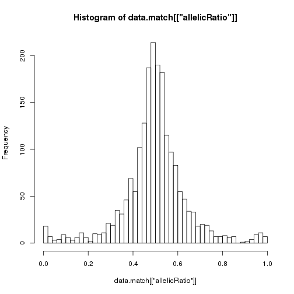
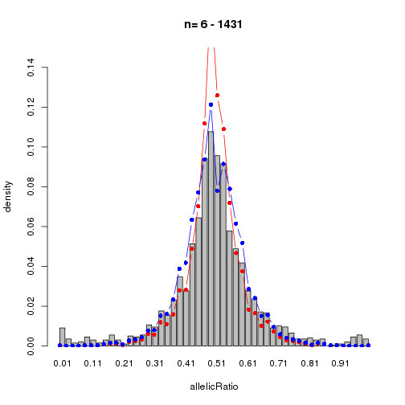
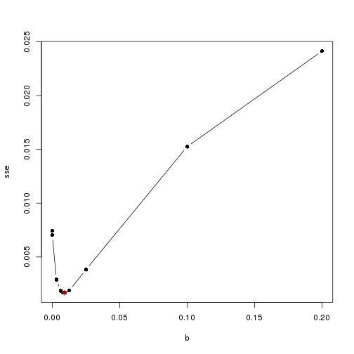

## Prepare the data.

This vignette requires the [npbin](https://github.com/anthony-aylward/npbin) 
package.


```r
library(chenimbalance)
library(npbin)
total_reads <- atac[["m"]]
data <- data.frame(
  total = total_reads,
  allelicRatio =  atac[["xm"]] / atac[["m"]]
)
data <- data[total_reads >= 5,]
data <- data[1:2000,]
head(data)
#>   total allelicRatio
#> 1     9    0.6666667
#> 2    71    0.6197183
#> 3    65    0.4307692
#> 4     7    0.4285714
#> 5     7    0.8571429
#> 6    14    0.7857143
```

## Empirical distribution

Compute the empirical allelic ratio distribution


```r
binSize <- 40
bins <- pretty(0:1, binSize)
minN <- 6
maxN <- min(2500, max(data[["total"]]))
empirical <- empirical_allelic_ratio(
  data,
  bins,
  maxN = maxN,
  minN = minN,
  plot = TRUE
)
```



## Expected Binomial and Beta-Binomial distributions

Compute the weighted expected binomial distribution


```r
w <- weight_by_empirical_counts(data[["total"]])
d_combined_sorted_binned <- nulldistrib(
  w,
  minN = minN,
  binSize = binSize
)
```

Compute the sum of squared errors for the empirical distribution vs the 
weighted expected binomial distribution.


```r
sse <- sum((empirical - d_combined_sorted_binned[,2])^2)
sse
#> [1] 0.007110035
```

Choose the overdispersion parameter for the beta-binomial distribution


```r
w_grad <- graded_weights_for_sse_calculation(r_min = 0, r_max = 1, bins = bins)
overdispersion_details <- choose_overdispersion_parameter(
  w_grad,
  w,
  empirical,
  sse
)
head(overdispersion_details[["b_and_sse"]])
#>        b          sse
#> [1,] 0.0 0.0071100351
#> [2,] 0.1 0.0007273913
#> [3,] 0.2 0.0031788478
#> [4,] 0.0 0.0000000000
#> [5,] 0.0 0.0000000000
#> [6,] 0.0 0.0000000000
```

Generate a plot of the weighted expected binomial and weighted expected 
beta-binomial distributions overlaid on the empirical distribution


```r
plot_distributions(
  minN,
  maxN,
  bins,
  empirical,
  d_combined_sorted_binned,
  overdispersion_details[["e_combined_sorted_binned"]],
  yuplimit = 0.15
)
```


`overdispersion_details` is a list whose elements include the chosen value of 
`b` and the sum of squared errors.


```r
paste(
  "b_chosen =",
  overdispersion_details[["b_choice"]],
  ", SSE_chosen =",
  overdispersion_details[["sse"]]
)
#> [1] "b_chosen = 0.1 , SSE_chosen = 0.000727391258190998"
```

Optimize the overdispersion parameter


```r
optimized_overdispersion_details <- optimize_overdispersion_parameter(
  w_grad,
  overdispersion_details[["b_and_sse"]],
  overdispersion_details[["b_choice"]],
  overdispersion_details[["sse"]],
  empirical,
  overdispersion_details[["counter"]],
  minN = minN,
  binSize = binSize
)
plot_distributions(
  minN,
  maxN,
  bins,
  empirical,
  d_combined_sorted_binned,
  optimized_overdispersion_details[["e_combined_sorted_binned"]],
  yuplimit = 0.15
)
```



Check the optimized value


```r
list(
  b = optimized_overdispersion_details[["b_choice"]],
  sse = optimized_overdispersion_details[["sse"]]
)
#> $b
#> [1] 0.06796875
#> 
#> $sse
#> [1] 0.0004410953
```

Plot the parameter search space


```r
b_and_sse <- (
  optimized_overdispersion_details[["b_and_sse"]]
  [1:(optimized_overdispersion_details[["counter"]] + 2),]
)
plot(
  b_and_sse[order(b_and_sse[,1]),],
  type = "b",
  pch = 16,
  xlim = c(min(b_and_sse[,1]), max(b_and_sse[,1])),
  ylim = c(min(b_and_sse[,2]), max(b_and_sse[,2]))
)
par(new = TRUE)
plot(
  optimized_overdispersion_details[["b_choice"]],
  optimized_overdispersion_details[["sse"]],
  bty = "n",
  ylab = "",
  xlab = "",
  yaxt = "n",
  xaxt = "n",
  col = "red",
  pch = 8,
  xlim = c(min(b_and_sse[,1]), max(b_and_sse[,1])),
  ylim = c(min(b_and_sse[,2]), max(b_and_sse[,2]))
)
```


